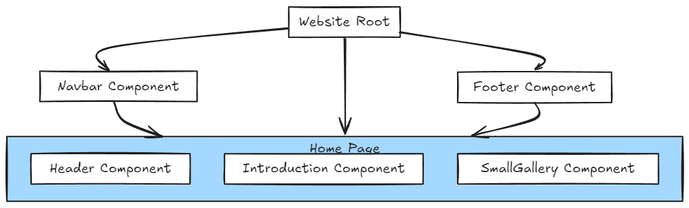

# ecportfolio


[](https://github.com/jdasilvalima/ec-portfolio/commits)

## I. PROJECT DESCRIPTION
### I.1 Introduction
**EcPortfolio** - is a website to showcase a photographer's work.

### I.2 Goals
The goal for this project was to create an interactive website while deepening my knowledge of modern frontend tools and techniques :

- Enhance frontend development skills using [Nuxt.js](https://nuxt.com/).
- Explore smooth scrolling techniques with [Lenis](https://lenis.darkroom.engineering/).
- Implement dynamic animations with [GSAP](https://gsap.com/) to create an engaging user experience.

## II. PROJECT SETUP
### II.1 Requirements
- [Node.js](https://nodejs.org/en/) needs to be installed.
- A package manager, such as npm or yarn, is required.


### II.2 Recommended IDE Setup

[VSCode](https://code.visualstudio.com/) + [Volar](https://marketplace.visualstudio.com/items?itemName=Vue.volar) (and disable Vetur) + [TypeScript Vue Plugin (Volar)](https://marketplace.visualstudio.com/items?itemName=Vue.vscode-typescript-vue-plugin).

**Type Support for `.vue` Imports in TS**

TypeScript cannot handle type information for `.vue` imports by default, so we replace the `tsc` CLI with `vue-tsc` for type checking. In editors, we need [TypeScript Vue Plugin (Volar)](https://marketplace.visualstudio.com/items?itemName=Vue.vscode-typescript-vue-plugin) to make the TypeScript language service aware of `.vue` types.

If the standalone TypeScript plugin doesn't feel fast enough to you, Volar has also implemented a [Take Over Mode](https://github.com/johnsoncodehk/volar/discussions/471#discussioncomment-1361669) that is more performant. You can enable it by the following steps:

1. Disable the built-in TypeScript Extension
    1) Run `Extensions: Show Built-in Extensions` from VSCode's command palette
    2) Find `TypeScript and JavaScript Language Features`, right click and select `Disable (Workspace)`
2. Reload the VSCode window by running `Developer: Reload Window` from the command palette.

**Customize configuration**

See [Vite Configuration Reference](https://vitejs.dev/config/).

### II.3 Project Setup

```sh
npm install
```

### Compile and Hot-Reload for Development

```sh
npm run dev
```

### Type-Check, Compile and Minify for Production

```sh
npm run build
```

### Lint with [ESLint](https://eslint.org/)

```sh
npm run lint
```

## III. APPLICATION ARCHITECTURE
The following schema illustrates how the components in the application are interconnected and their hierarchical relationships.

